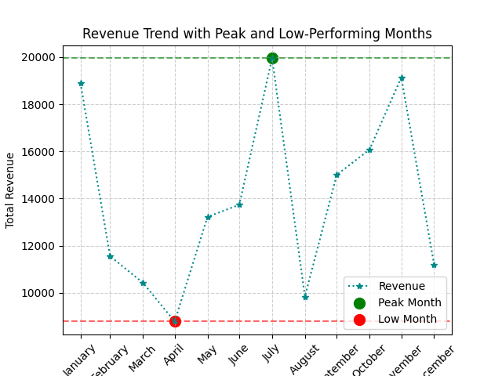
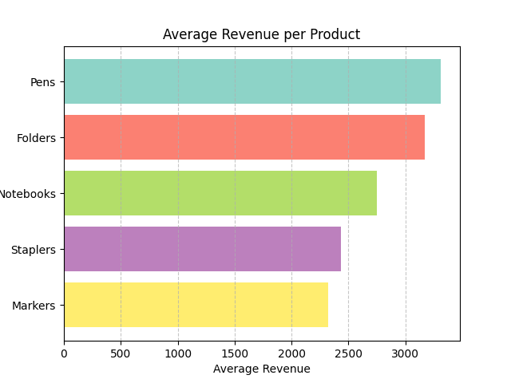
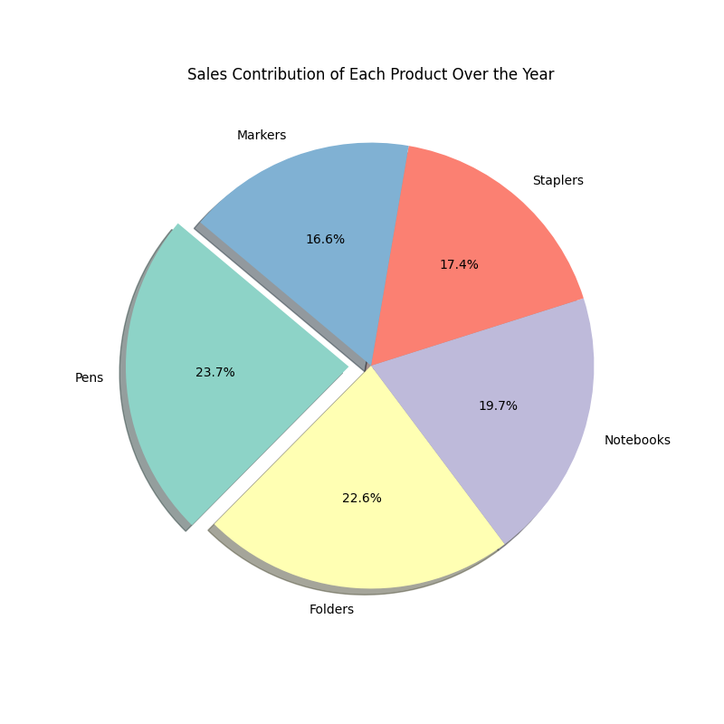
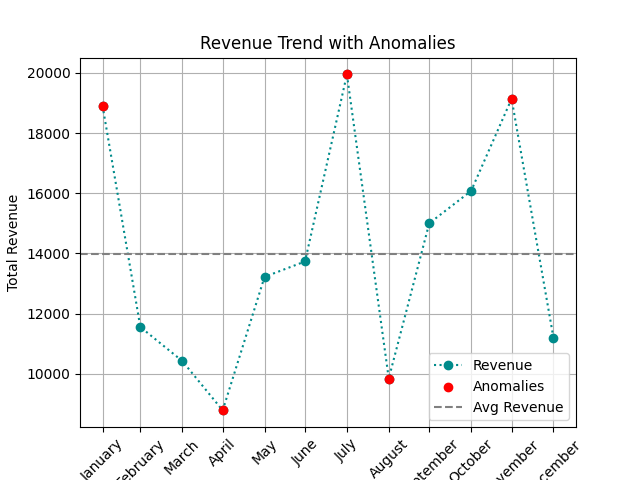

# 📊 Sales Data Storytelling Project

> A collaborative data storytelling project focused on uncovering trends, patterns, and insights from sales data using Python and data visualization.

---

## 🧠 Project Overview

This project was created as part of our CAPACITI Data Analyst programme. Working as a team, we were tasked with analyzing a sales dataset and producing visual insights that tell a story about revenue performance across time and products.

Our main goals:
- Analyze revenue trends across months
- Identify high and low-performing periods
- Determine the best-selling products
- Detect anomalies in the data

---

## 📁 Dataset

We used a dataset called `sales_data_storytelling.csv`, which contains:
- **Month**: Transaction month
- **Product**: Product category
- **Revenue**: Revenue generated per product/month

---

## 📊 Key Questions Answered

### 1️⃣ Revenue Trend Over Time
- Grouped revenue by month
- Visualized high and low-performing months
- Output: `Question1.png`

### 2️⃣ Average Revenue per Product
- Calculated mean revenue by product category
- Displayed results in a horizontal bar chart
- Output: `Question2.png`

### 3️⃣ Total Sales Contribution per Product
- Created a pie chart to visualize product revenue shares
- Highlighted the top-selling product
- Output: `Question3.png`

### 4️⃣ Revenue Anomalies
- Calculated average revenue and standard deviation
- Flagged outlier months outside ±1 standard deviation
- Output: `Question4.png`

---

## 🖼️ Visual Outputs

Here are some of the charts produced:

| Revenue Trend | Best-Selling Product | Product Contribution | Revenue Anomalies |
|---------------|----------------------|----------------------|-------------------|
|  |  |  |  |

---

## 🧰 Tools & Technologies

- **Python 3**
- **Pandas** for data analysis
- **Matplotlib** & **NumPy** for visualization and numerical operations
- **Jupyter Notebook** (recommended for exploring interactively)

---

## 👥 Contributors

This was a collaborative project under the **CAPACITI Data Analyst Programme**.

**Main Contributor (GitHub Repo Owner):**
- 🧑 Tracey-Lee Swartz  
  [LinkedIn](https://www.linkedin.com/in/tracey-lee-swartz/) • tswartz03@outlook.com

> *If you're a team member who worked on this project, feel free to open a PR to add your name here!*

